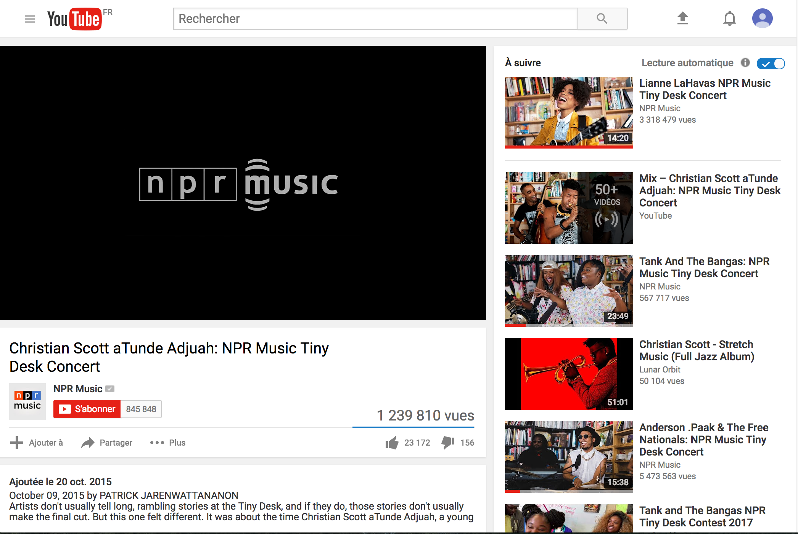

# React App

Pour faire un projet avec create-react-app dans votre terminal.

```
npm install -g create-react-app

create-react-app <NOM-DE-MON-APP>
cd <NOM-DE-MON-APP>/
npm start
```

Il faut ensuite changer les fichier dans app/src.

## Component simple et lifecycle

Syntaxe d'un component simple :

```
import React, { Component } from 'react';

class <COMPONENT-NAME> extends Component {
  render () {
    return (
      <div className="<COMPONENT-CLASS>"></div>
    )
  }
}

export default <COMPONENT-NAME>;
```
Plus d'informations dans les dossiers app/src/Test

## Data-binding

React permet de passer des données de père en fils, mais pas de fils en père.
Comment contourner ce problème et passer des données d'un enfant vers le parent ou entre sibling ?
On prend 3 components : Parent, ChildA, ChildB.


Je crée une variable dans le state du Parent.
```
  state = { myValue : true }
```

Je la passe à ChildA via une props (attribut)
```
<ChildA valueName={this.state.myValue}></ChildA>
```

Je crée une function dans Parent qui sera passé à ChildB via une props également.

```
<ChildB functionName={this.myFunction}></ChildB>
```

Cette function va changer la variable myValue du state du Parent.

```
myFunction () {
  this.setState({ myValue: false });
}
```

J'appelle cette fonction dans un élément du render de ChildA.
```
<div onClick={this.props.functionName}></div>
```

## Router

Un exemple dans src/Router
Il faut d'abord installer les modules react-router, react-router-dom (qu'on utilise pour les components Link) et history.
```
npm i -S react-router history react-router-dom
```
Puis importer le Router et initialiser la variable `history` dans le fichier concerné.
```
import {Router, Route, Redirect} from 'react-router';
import createBrowserHistory from 'history/createBrowserHistory';

const history = createBrowserHistory();
```

Le Router n'accepte qu'un enfant unique, il faut donc englober les components Route dans une div ou autre élement html.
```
<Router history={history}>
  <div>
    <Route exact path="/" component={ComponentName} />
    <Route path="/" component={ComponentName}/>
  </div>
</Router>
```

Les components Redirect permettent de rediriger vers un chemin, c'est très pratique si on veut afficher du contenu selon une condition. Par exemple si un utilisateur est connecté.
```
{
  /* Conditionnal rendering : je n'affiche que via une condition */
  this.state.userConnected ? (
    <Redirect to="/home" />
  ) : (
    <Redirect to="/" />
  )
}
```

Les components Link appartiennent à react-router-dom, il faut donc l'importer dans les fichiers concernés.
```
import {Link} from 'react-router-dom';
```

Puis les inclure dans le render.
```
<Link to="/">
```


=============================================

Essayez de trouver dans les images suivantes des :

1. Conditions / Conséquences
2. Répétitions
3. Exceptions

### Facebook

=============================
### Twitter

=============================
### Youtube

=============================
### Player

=============================
### Soundcloud

=============================
### Pinterest

=============================
### Blog

